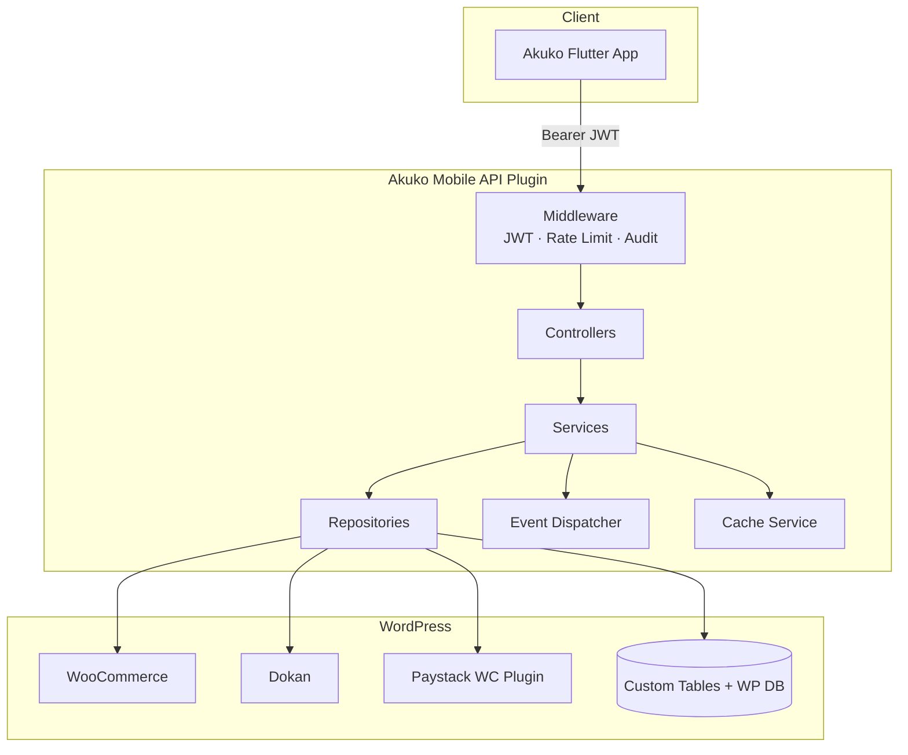
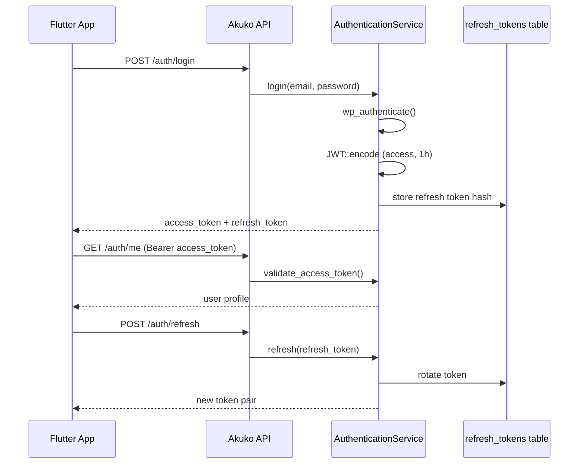
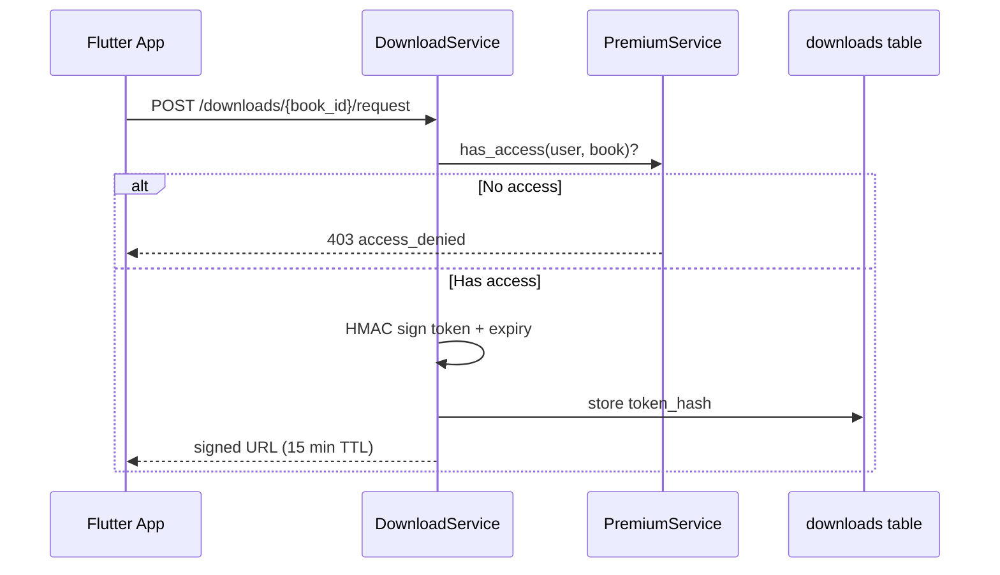
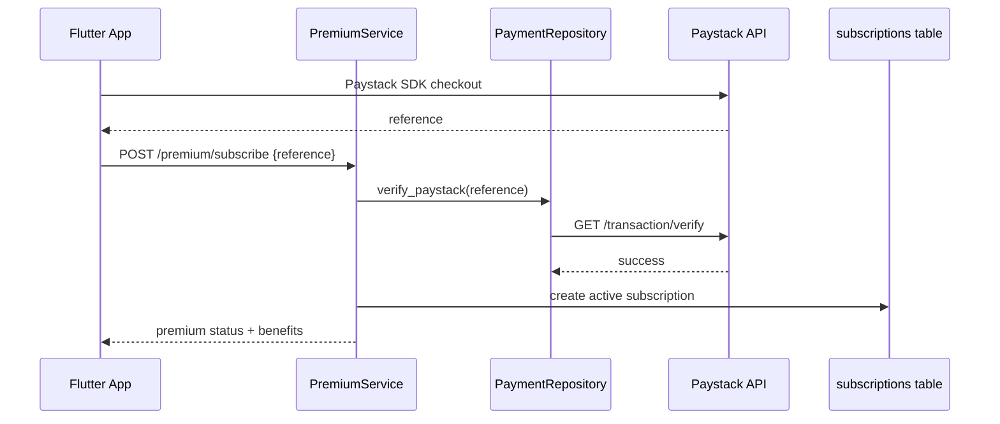
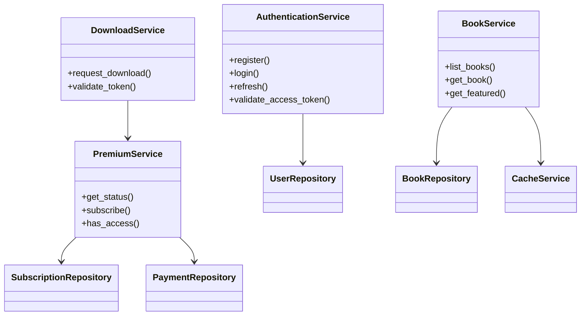

# Architecture

## Overview

The Akuko Mobile API is a BFF layer that exposes a mobile-optimized REST API at `/wp-json/akuko/v1/*`. The Flutter app never talks directly to WooCommerce, Dokan, or Paystack — all integration is abstracted behind services and repositories.



## Folder Structure

```
akuko-mobile-api/
├── akuko-mobile-api.php       # Bootstrap, activation hooks
├── composer.json              # PSR-4 autoload, firebase/php-jwt
├── includes/
│   ├── class-akuko-plugin.php
│   ├── class-akuko-container.php
│   ├── api/                   # REST route registration
│   ├── controllers/           # Thin HTTP layer
│   ├── services/              # Business logic + interfaces/
│   ├── repositories/          # Data access + interfaces/
│   ├── models/                # DTOs / transformers
│   ├── middleware/            # JWT, rate limit, audit
│   ├── helpers/
│   ├── validators/
│   ├── cache/
│   ├── events/
│   ├── jobs/
│   └── notifications/
├── admin/                     # WP Admin UI
├── database/migrations/       # dbDelta schema
├── tests/
└── docs/
```

## Layer Responsibilities

| Layer | Responsibility |
|-------|----------------|
| **Controllers** | Validate input, auth checks, call service, return JSON envelope |
| **Services** | Business rules, orchestration, premium/download logic |
| **Repositories** | All SQL via `$wpdb->prepare`, WC/WP abstraction |
| **Models** | Transform WC_Product → mobile JSON DTO |
| **Middleware** | Cross-cutting: JWT, rate limiting, audit logs |

## Authentication Flow



## Download Flow



## Premium Flow



## Payment Flow

Book purchases use existing WooCommerce + Paystack checkout on web or in-app WebView. Mobile calls `POST /payments/verify` to confirm transaction status. Premium uses `POST /premium/subscribe` after Paystack success.

## Class Diagram (Services)



## Response Envelope

All endpoints return:

```json
{
  "success": true,
  "data": {},
  "error": null,
  "meta": { "page": 1, "per_page": 20, "total": 100 }
}
```

## Events

| Event | Trigger |
|-------|---------|
| `book_purchased` | `woocommerce_order_status_completed` |
| `premium_activated` | Successful premium subscribe |
| `book_downloaded` | Download token issued |
| `review_submitted` | New review created |

## Security

- JWT HS256 with rotatable secret
- Refresh tokens stored as SHA-256 hashes
- Rate limit: 120 req/min per IP (transients)
- All repository queries use prepared statements
- Paystack secret via `wp-config.php` constant (never hardcoded)
