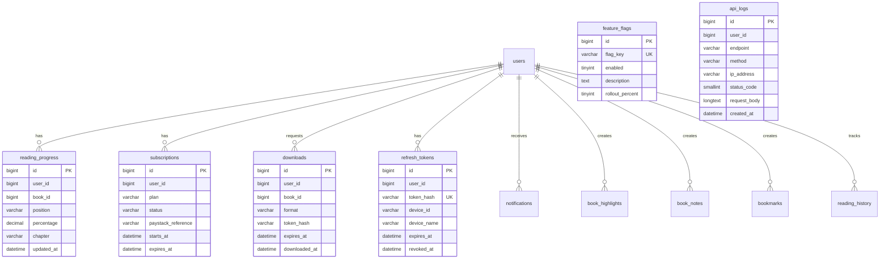

# Database Schema

All tables use prefix `{wp_prefix}akuko_`.

## ERD

## Tables

| Table | Purpose |
|-------|---------|
| `reading_progress` | Per-user book reading position |
| `reading_statistics` | Aggregate reading time/sessions |
| `book_highlights` | Highlighted text with CFI |
| `book_notes` | User notes with CFI |
| `reading_history` | Open events for analytics |
| `subscriptions` | Mobile premium entitlements |
| `downloads` | Signed download tokens |
| `api_logs` | Audit trail |
| `notifications` | In-app notifications |
| `feature_flags` | Feature toggles |
| `refresh_tokens` | JWT refresh token sessions |
| `bookmarks` | Reader bookmarks |

## Migration

File: `database/migrations/001_initial_schema.php`

Run on plugin activation via `Initial_Schema::run()` using WordPress `dbDelta()`.

Version tracked in option: `akuko_mobile_api_db_version`

## User Meta (non-table)

| Meta Key | Purpose |
|----------|---------|
| `_akuko_wishlist` | Array of book IDs |
| `_akuko_push_devices` | FCM/APNs device tokens |
