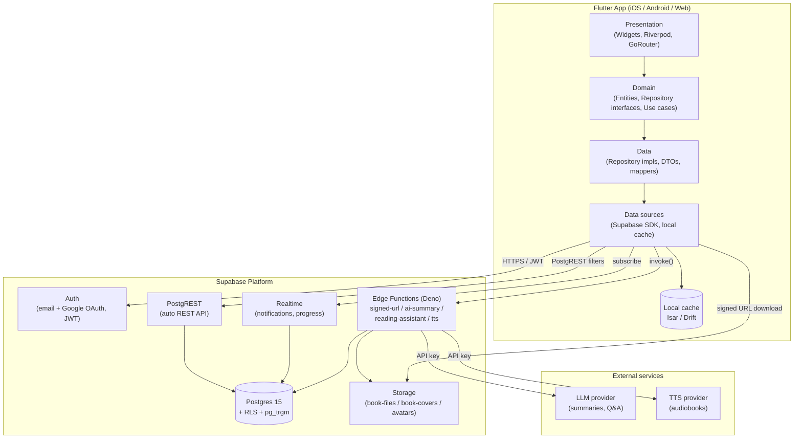
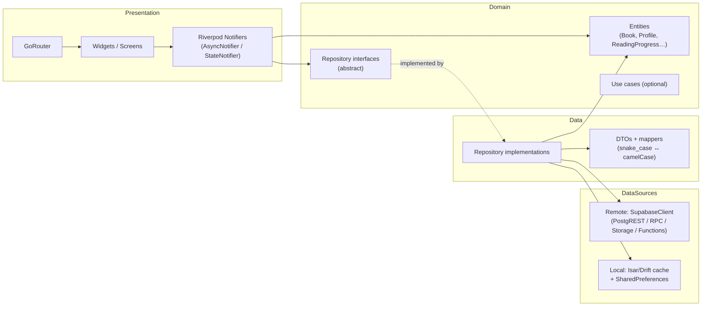
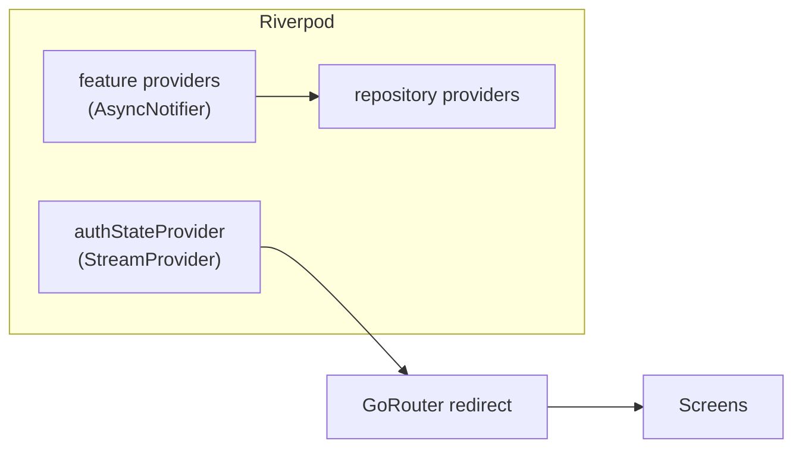
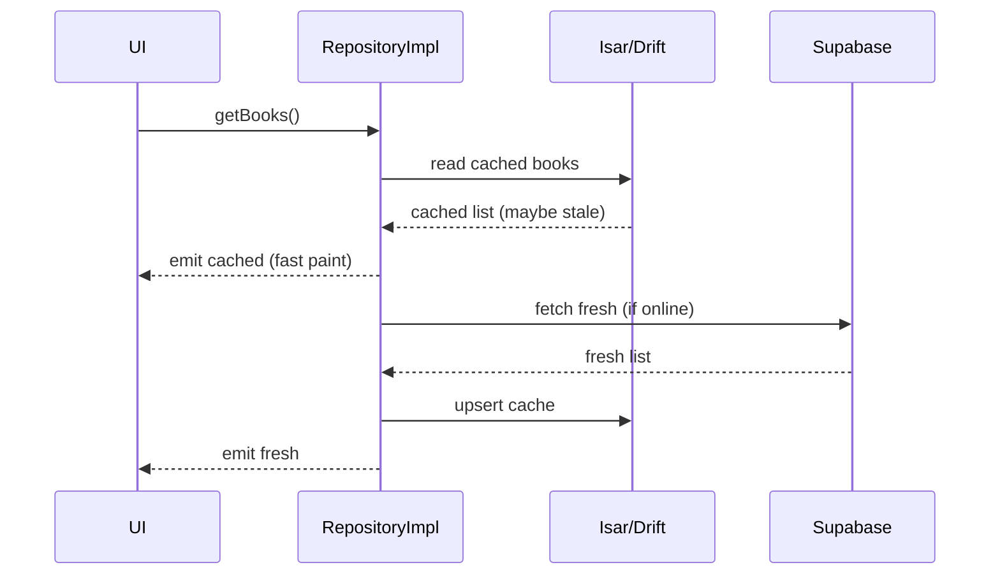

# Akuko — System Architecture

> Source of truth for the data model: [`CANONICAL_SPEC.md`](./CANONICAL_SPEC.md).
> This document describes how the Flutter client and the Supabase backend fit
> together, the Clean Architecture layering, and the offline strategy.

---

## 1. High-level system

Akuko is a Flutter 3.x client backed entirely by Supabase (Postgres, Auth,
Storage, Realtime, Edge Functions). AI/TTS features are delegated to external
providers, called only from Edge Functions so that provider keys never reach
the client.



**Key principles**

- The client talks to Postgres **only** through PostgREST (RLS-enforced) and
  RPC. It never holds a service-role key.
- Private book files are never publicly readable; the client requests a
  short-lived **signed URL** from the `signed-url` Edge Function, which enforces
  premium/subscription gating with the service role.
- External AI/TTS keys live **only** in Edge Function secrets.

---

## 2. Clean Architecture layers



**Dependency rule:** dependencies point inward. Presentation depends on Domain
abstractions; Data implements Domain; nothing in Domain imports Flutter or
Supabase. Mapping between DB `snake_case` and Dart `camelCase` happens in the
Data layer (DTOs), keeping Domain entities pure Dart.

### Layer responsibilities

| Layer | Responsibility | Example |
|-------|----------------|---------|
| **Presentation** | UI, navigation, state | `BookDetailScreen`, `bookDetailProvider`, routes |
| **Domain** | Business entities + repository contracts | `Book`, `BookRepository` (abstract) |
| **Data** | Implement contracts, map DTOs, choose remote/local | `BookRepositoryImpl`, `BookDto.fromJson` |
| **Data sources** | Raw I/O | `SupabaseClient`, `IsarCollection<BookCache>` |

---

## 3. Repository Pattern

Every feature exposes an **abstract repository** in the Domain layer; the Data
layer provides a Supabase-backed implementation. Riverpod providers expose the
abstraction so the UI is decoupled from Supabase and tests can inject fakes.

```text
domain/repositories/book_repository.dart        // abstract
data/repositories/book_repository_impl.dart      // Supabase + cache
data/datasources/book_remote_datasource.dart     // PostgREST calls
data/datasources/book_local_datasource.dart      // Isar/Drift cache
```

The concrete query/RPC/Edge-function mapping for each repository method is
defined in [`API_DESIGN.md`](./API_DESIGN.md).

---

## 4. State management & navigation

- **Riverpod** is the single source of UI state. Async reads use
  `AsyncNotifier`/`FutureProvider`; the auth state is a `StreamProvider` wired to
  `supabase.auth.onAuthStateChange`. Repositories are exposed via `Provider`s so
  they can be overridden in tests.
- **GoRouter** owns navigation. A top-level `redirect` reads the auth provider:
  unauthenticated users are sent to `/login`; authenticated users away from auth
  routes. Deep links (`io.akuko.app://login-callback`) resolve the OAuth/PKCE
  flow back into the app.



---

## 5. Offline strategy

Akuko is read-heavy and must work on flaky networks (reading mid-flight).

**Local store:** Isar or Drift for structured cache (books, categories,
progress, bookmarks, notes), plus the device filesystem for downloaded book
files and `SharedPreferences` for small flags.

**Read path (cache-first):**



**Write path (offline-tolerant):** user-owned mutations (reading progress,
bookmarks, highlights, notes) are written to the local store immediately and
queued as **outbox** rows. A sync worker flushes the outbox to Supabase when
connectivity returns. Conflict resolution is **last-write-wins** keyed on
`updated_at`/`last_read_at`; `reading_progress` is naturally idempotent via the
unique `(user_id, book_id)` constraint (upsert).

**Downloaded books:** premium/owned files are fetched via a signed URL and
stored on-device for offline reading; the reader resolves location from cached
`reading_progress`.

**Realtime:** `notifications` and (optionally) cross-device `reading_progress`
use Supabase Realtime so a second device reflects changes live.

---

## 6. Security model (summary)

- **RLS everywhere.** Every table has RLS enabled (see
  [`DATABASE_SCHEMA.md`](./DATABASE_SCHEMA.md) for the policy matrix).
- **Public-read content:** `books`, `categories`, `subscription_plans`,
  `reviews`, public `reading_lists`.
- **Owner-only:** all per-user tables gated by `auth.uid() = user_id`.
- **Admin writes** for catalog data via the `is_admin()` SQL helper.
- **Service-role** operations (signing URLs, caching AI output, granting
  subscriptions) happen only inside Edge Functions.

See [`SUPABASE_SETUP.md`](./SUPABASE_SETUP.md) for provisioning and
[`DEPLOYMENT.md`](./DEPLOYMENT.md) for production hardening.
