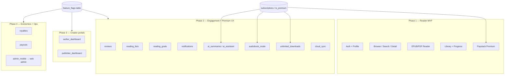

# Akuko ecosystem architecture (phased launch)

## African modernist UI (2026)

Earth-toned palette (`AppColors`: `earthBackground`, `burntSienna`, `forestGreen`,
`cobaltBlue`, `warmGold`) replaces violet-centric theming. Custom widgets:
`AkukoLogoMark`, `AfricanPatternPainter` (tier cards), `CircularJourneyVisual`
(journey ring + milestone badges), `GenreGridCard`.

| Feature | Path | Status |
|---------|------|--------|
| Language filter | `selectedLanguageFilterProvider` | Wired — client filter on `books.language` |
| Reading Circles | `features/reading_circles/` | Stub — mock circles + `ReadingCircleSheet` |
| Author Support Fund | `authorSupportFundProvider` | Wired — `shared_preferences`, checkout +5% |
| Circular journey | `circular_journey_visual.dart` | Wired — Home + Library |
| My Authors | `features/authors/` | Partial — DB join when `authors` table exists |
| Gifting | `features/gifting/` | Stub — `GiftSheet`, Paystack TODO |
| Milestone notifications | `journeyMilestoneWatcherProvider` | Partial — client insert if RLS allows |

> Mobile client (`akuko/lib`) — feature flags, subscriptions, and role surfaces.
> Backend migrations `0008+` and web admin are out of scope for this document’s
> implementation task but are referenced for activation.

---

## Phased launch (Mermaid)

---

## Role matrix

| Role | Primary surfaces | Phase | Gated by |
|------|------------------|-------|----------|
| **Reader** | Home, search, library, reader, profile | 1 | Auth only |
| **Premium reader** | Ad-free, AI, audiobook, unlimited downloads | 2+ | `SubscriptionGuard` + flags |
| **Author** | `/author` dashboard (placeholder) | 3 | `author_dashboard` |
| **Publisher** | `/publisher` dashboard (placeholder) | 3–4 | `publisher_dashboard` |
| **Admin** | `/admin` deep link → web admin | 4 | `admin_mobile` + `profiles.is_admin` |

Mobile does **not** ship full admin, royalty, or payout UIs — flags hide routes and
`SubscriptionGuard` hides premium product entry points until both subscription
and flags allow them.

---

## Phase 1 vs hidden

| Ships Phase 1 | Hidden until flag (+ often premium) |
|---------------|--------------------------------------|
| Email auth, profile | Author / publisher dashboards |
| Catalogue, book detail, reader | Reviews, lists, goals, notifications |
| Library, bookmarks, progress | AI summaries, reading assistant |
| Paystack subscription page | Audiobook / TTS UI |
| `ads` flag default **on** for free tier | Royalties, payouts |
| | Mobile admin (web only) |

---

## Feature flag keys (`AppFeatures`)

| Key | Default (no DB) | Phase |
|-----|-----------------|-------|
| `ads` | enabled | 1 |
| `reviews`, `reading_lists`, `reading_goals`, `notifications`, `highlights` | off | 2 |
| `ai_summaries`, `ai_assistant`, `audiobook_mode`, `unlimited_downloads`, `cloud_sync` | off | 2 |
| `author_dashboard`, `publisher_dashboard` | off | 3 |
| `royalties`, `payouts`, `admin_mobile` | off | 4 |

Remote rows in `feature_flags` override client defaults after `featureFlagsProvider`
refresh on app start.

---

## Subscriptions × feature flags

`SubscriptionGuard` requires **both** entitlement (from `Entitlements` / Paystack
subscription) **and** the matching flag:

| Guard method | Subscription | Feature flag(s) |
|--------------|--------------|-----------------|
| `isPremium()` | `isPremium` | — |
| `canUseAISummaries()` | `aiFeatures` | `ai_summaries` |
| `canUseAIAssistant()` | `aiFeatures` | `ai_assistant` |
| `canUseAI()` | `aiFeatures` | `ai_summaries` **or** `ai_assistant` |
| `canUseAudiobooks()` | `audiobooks` | `audiobook_mode` |
| `canDownloadUnlimited()` | `unlimitedDownloads` | `unlimited_downloads` |
| `canCloudSync()` | `cloudSync` | `cloud_sync` |
| `showsAds()` | `showAds` (free) | `ads` |

Server-side enforcement (`signed-url`, `tts`, future AI edges) remains authoritative;
the guard is the client UX boundary.

---

## Client integration map

| Layer | Path | Responsibility |
|-------|------|----------------|
| Entity | `lib/core/feature_flags/feature_flag.dart` | Flag model + snapshot |
| Keys | `lib/core/feature_flags/app_features.dart` | Wire keys + Phase 1 defaults |
| Data | `lib/core/feature_flags/supabase_feature_flag_repository.dart` | Fetch + in-memory cache |
| DI | `lib/core/feature_flags/feature_flag_provider.dart` | `featureFlagsProvider`, `isFeatureEnabledProvider` |
| Guard | `lib/core/guards/subscription_guard.dart` | Premium × flags |
| Router | `lib/core/router/app_router.dart` | `/author`, `/publisher`, `/admin` → `/coming-soon` when off |
| Analytics | `lib/core/analytics/analytics_service.dart` | `track()` → `analytics_events` or no-op |
| Book workflow | `lib/shared/domain/entities/book.dart` | Optional `status`, `pricingModel` |

---

## Phase 2–4 activation checklist

1. **Deploy migration `0008`** (not in this repo task): `feature_flags`, `analytics_events`, optional `books.status` / `books.pricing_model`.
2. **Seed flags** in Supabase (or web admin) — set `enabled = true` per rollout.
3. **No app store release required** for toggles: clients refresh flags on cold start; invalidate with `ref.invalidate(featureFlagsProvider)` after admin push if you add a pull-to-refresh later.
4. **Implement feature UI** under `lib/features/<name>/` and gate with `isFeatureEnabledProvider` + `SubscriptionGuard` where premium applies.
5. **Wire analytics** — inject `ref.read(analyticsServiceProvider).track('book_opened', bookId: id)` at product events.
6. **Phase 3** — flesh out `author_feature.dart` / `publisher_feature.dart` data layers.
7. **Phase 4** — royalties/payouts modules; keep payouts behind `payouts` flag.

---

## Book workflow (client-ready)

| Field | Type | Notes |
|-------|------|-------|
| `status` | `draft` \| `pending_review` \| `published` \| … | Nullable — null treated as published in catalogue |
| `pricingModel` | `free` \| `one_time` \| `premium_only` \| … | Nullable for legacy rows |

Admins see a **Pending review** chip on book detail when `status == pending_review`
and `profiles.is_admin`.

---

## Related docs

- `docs/ECOSYSTEM_AUDIT.md` — baseline gaps and migration order
- `docs/CANONICAL_SPEC.md` — product phases
- `akuko/admin/.env.example` — web admin configuration (separate from mobile `.env`)
