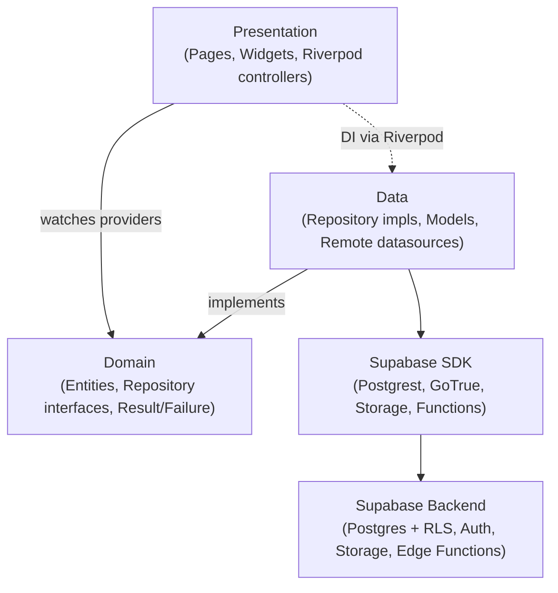

# Akuko — Project Audit

> Evidence-based audit of the existing Flutter + Supabase "Akuko" ebook-reader
> codebase. Every claim below is grounded in a concrete file path. No source
> code or assets were modified to produce this report; this file is the only
> addition.
>
> **Verification caveat:** Flutter/Dart SDK is **not installed** in this
> environment, so `flutter analyze` / `flutter test` / `dart pub get` could not
> be run. "Won't compile" claims are therefore reasoned from source inspection,
> not from a compiler, and are flagged as such in §6.

---

## 1. Existing architecture

The app follows **Clean Architecture + Repository Pattern**, feature-first
folder layout, **Riverpod** for state/DI, **GoRouter** for navigation, and a
dependency-free `Result<T>` / `Failure` error pipeline.

**Layering (per feature):**
- `presentation/` — pages, widgets, controllers (Riverpod providers/notifiers).
- `domain/` — entities + abstract repository interfaces (e.g.
  `features/auth/domain/repositories/auth_repository.dart`).
- `data/` — `datasources/` (raw Supabase calls), `models/` (JSON↔entity), and
  `repositories/` (impl that maps exceptions → `Failure`).

**Core (`lib/core/**`):**
- `core/config/env.dart` — `Env` resolves config from `--dart-define` first,
  then `.env` (flutter_dotenv), with fallbacks; `Env.isConfigured` gate.
- `core/config/supabase_config.dart` — static URL/anon-key/redirect + bucket
  name constants.
- `core/network/supabase_client_provider.dart` — `supabaseClientProvider`,
  `supabaseAuthProvider`, `authStateChangesProvider`.
- `core/router/app_router.dart` — `routerProvider` GoRouter with auth-aware
  redirect + `StatefulShellRoute.indexedStack` bottom-nav shell;
  `core/router/routes.dart` (path/name constants + builders);
  `core/router/main_shell.dart`.
- `core/error/failures.dart` — sealed `Failure` hierarchy (`NetworkFailure`,
  `ServerFailure`, `AuthFailure`, `NotFoundFailure`, `CacheFailure`,
  `ValidationFailure`, `UnknownFailure`) + `describeError()`.
- `core/error/exceptions.dart` — low-level `AppException` types thrown by
  datasources.
- `core/utils/result.dart` — sealed `Result<T>` = `Ok<T>` | `Err<T>`, with
  `map`/`fold`/`getOrThrow` and `guardAsync()`.
- `core/theme/` — `app_theme.dart`, `app_colors.dart`, `theme_controller.dart`
  (Material 3 light/dark) and `reader_theme.dart` (reader Light/Dark/Sepia +
  font size/line spacing/font family `ReaderSettings`).
- `core/widgets/` — shared `app_button`, `app_text_field`, `loading_view`,
  `error_view`, `empty_view`.
- `core/constants/app_constants.dart` — `AppConstants` + `SupabaseTables` name
  map.

**Bootstrap:** `lib/main.dart` loads `.env`, checks `Env.isConfigured` (renders
`_ConfigErrorApp` if not), calls `Supabase.initialize(url, anonKey)`, builds
`SharedPreferences`, then runs `AkukoApp` (`lib/app.dart`) inside a
`ProviderScope`. `AkukoApp` wires `MaterialApp.router` to `routerProvider` +
`themeModeControllerProvider`.

**MVP features present:** `auth`, `books`, `reader`, `library`, `profile` are
fully layered (data/domain/presentation). **Phase-2 features are single-file
stubs** (`features/<name>/<name>_feature.dart`, each just a `library;`
declaration): `reviews`, `reading_lists`, `goals`, `subscriptions`, `ai`,
`tts`, `notifications`, `admin`.

---

## 2. Existing database schema

Source of truth: `docs/CANONICAL_SPEC.md`; implemented in
`supabase/migrations/0001_schema.sql`. The migration matches the spec exactly
(16 tables). Dart models mirror these via `SupabaseTables` in
`core/constants/app_constants.dart`.

**Tables (16):**
`profiles`, `categories`, `books`, `reading_progress`, `bookmarks`,
`highlights`, `notes`, `reviews`, `reading_lists`, `reading_list_items`,
`reading_goals`, `reading_streaks`, `subscription_plans`,
`user_subscriptions`, `ai_summaries`, `notifications`.

**Key relationships:**
- `profiles.id` → `auth.users.id` (1:1, `on delete cascade`).
- `books.category_id` → `categories.id` (`on delete set null`).
- `reading_progress`, `bookmarks`, `highlights`, `notes`, `reviews`,
  `reading_lists`, `reading_goals`, `notifications`, `user_subscriptions` all
  reference `profiles.id` via `user_id` (cascade) and most reference
  `books.id` (cascade).
- `reading_list_items.list_id` → `reading_lists.id`; `.book_id` → `books.id`.
- `reading_streaks.user_id` PK → `profiles.id` (1:1).
- `user_subscriptions.plan_id` → `subscription_plans.id` (`on delete restrict`).
- `ai_summaries.book_id` → `books.id`.

**Uniqueness:** `reading_progress(user_id,book_id)`, `reviews(user_id,book_id)`,
`reading_list_items(list_id,book_id)`, and a `nulls not distinct` unique index
`uq_ai_summaries_lookup(book_id,summary_type,chapter_ref)`.

**Notable absences vs a fuller catalog model:** there is **no `authors`
table** (author is a free-text `books.author` column) and **no `downloads`
table** (only a `books.download_count` integer counter). There is also no
dedicated `subscriptions`/payments/transactions table beyond the two
subscription tables (see §5/§B).

---

## 3. Existing migrations (file-by-file)

All under `supabase/migrations/`, numerically ordered 0001→0005.

- **`0001_schema.sql`** — Extensions (`pgcrypto`, `uuid-ossp`, `pg_trgm`). All
  16 tables. Browse/filter indexes on `books` (`category_id`, partial indexes
  on `is_featured`/`is_trending`/`is_new_release`, `created_at desc`) plus GIN
  trigram indexes on `books.title`/`books.author` for search. Owner-scoped
  indexes (`reading_progress`, `bookmarks`, `highlights`, `notes`,
  `reading_lists`, `reading_list_items`, `reading_goals`,
  `user_subscriptions` incl. partial active index, `notifications` unread
  index). CHECK constraints match the canonical spec.
- **`0002_rls.sql`** — Defines a minimal `is_admin()` (re-defined in 0003),
  enables RLS on **all 16 tables**, and creates policies: `profiles`
  (everyone-auth read, owner insert/update, admin update-all); `categories`,
  `books`, `subscription_plans` (public read / admin write); generic
  owner-only `for all` policies on `reading_progress`, `bookmarks`,
  `highlights`, `notes`, `reading_goals`, `reading_streaks`; `user_subscriptions`
  **select-own only** (no insert/update → backend/service-role writes only);
  `notifications` (select/update/delete own); `reviews` (public read, owner
  write); `reading_lists` (owner full + public readable); `reading_list_items`
  (mirrors parent list visibility); `ai_summaries` (**select to all
  authenticated**, no insert/update → service-role writes only).
- **`0003_functions_triggers.sql`** — `is_admin()` (SECURITY DEFINER, stable,
  `search_path=public`); `handle_new_user()` (+ `on_auth_user_created` trigger
  on `auth.users`) seeds `profiles` (pulling `full_name`/`name`,
  `avatar_url`/`picture` from OAuth metadata) and `reading_streaks`;
  `set_updated_at()` triggers on `profiles`/`books`/`notes`/`reviews`;
  `recompute_book_rating()` keeps `books.rating_avg`/`rating_count` in sync on
  review insert/update/delete; `touch_reading_streak()` updates streaks on
  `reading_progress` activity.
- **`0004_storage.sql`** — Creates buckets `book-files` (private, 500 MB,
  epub/pdf MIME), `book-covers` (public, 10 MB, images), `avatars` (public,
  5 MB, images). RLS on `storage.objects`: `book-files` admin-only direct
  read/write (end users go through the signed-url function); `book-covers`
  public read / admin write; `avatars` public read + owner write keyed on
  `storage.foldername(name)[1] = auth.uid()`.
- **`0005_seed.sql`** — Reference/sample data with fixed UUIDs (idempotent
  `on conflict do nothing`): 8 categories, 12 books (mix of epub/pdf,
  premium/free), 2 subscription plans (monthly $9.99 / yearly $99.99 with a
  `features` jsonb listing `ai_summaries`, `tts_audiobooks`,
  `offline_downloads`, etc.). Cover/file URLs are placeholder storage paths.
  **This is a data-seed migration; running it against production seeds demo
  content** (see §10).

---

## 4. Existing API integrations

**Supabase client init:** `Supabase.initialize` in `lib/main.dart` using
`SupabaseConfig.url`/`anonKey` (from `Env`). Exposed via
`supabaseClientProvider`.

**Supabase Postgrest/Auth/Storage calls (client):**
- **Auth** (`features/auth/data/datasources/auth_remote_datasource.dart`):
  `signInWithPassword`, `signUp` (with `full_name` metadata),
  `signInWithIdToken` (Google native via `google_sign_in`),
  `resetPasswordForEmail(redirectTo: authRedirect)`, `signOut`. Auth state via
  `onAuthStateChange`.
- **Books** (`features/books/data/datasources/book_remote_datasource.dart`):
  reads `books`/`categories` — featured/trending/new (`.eq(flag,true)`),
  by-category (paged `.range`), search (`.or('title.ilike…,author.ilike…')`),
  `getById`, `listCategories`.
- **Reading** (`features/reader/data/datasources/reading_remote_datasource.dart`):
  `reading_progress` upsert (`onConflict: 'user_id,book_id'`) + get;
  `bookmarks` insert/list/delete (scoped by `auth.currentUser.id`).
- **Library** (`features/library/data/datasources/library_remote_datasource.dart`):
  `reading_progress` with embedded `books(*)` (Postgrest foreign-table
  embedding) for "continue reading".
- **Profile** (`features/profile/data/datasources/profile_remote_datasource.dart`):
  reads/updates `profiles`.

**Edge functions (`supabase/functions/**`, all `verify_jwt = true` in
`config.toml`):**
- **`signed-url/index.ts`** — validates JWT, loads book via service role,
  enforces premium gating (active `user_subscriptions`), returns a short-lived
  `createSignedUrl` for `book-files`. Contains `TODO: optionally increment
  books.download_count`.
- **`ai-summary/index.ts`** — cache lookup in `ai_summaries`, else calls an LLM
  via `generateSummary()` — **STUB** (returns `[[STUB SUMMARY…]]` /
  `[[TODO: call <model>]]`; real provider call commented out). Caches result.
- **`reading-assistant/index.ts`** — book-scoped Q&A; retrieval is an empty
  array (`TODO (RAG)`), LLM call is a **STUB**.
- **`tts/index.ts`** — premium-gated; returns `501 not_configured` without
  `TTS_API_KEY`, else `202 processing` with a random jobId. Synthesis/upload is
  a `TODO` (no real provider).
- **`_shared/cors.ts`** — CORS helpers; `Access-Control-Allow-Origin` defaults
  to `*` (`CORS_ALLOW_ORIGIN` override).

**External services referenced (not implemented):** Google OAuth
(`google_sign_in` + `auth.external.google` in `config.toml`); LLM provider
(`LLM_API_KEY`/`LLM_MODEL`, default `gpt-4o-mini`); TTS provider
(`TTS_API_KEY`/`TTS_PROVIDER`, default `elevenlabs`). **No payment provider
(e.g. Paystack/Stripe) is referenced anywhere.**

**Critical integration gap:** the Flutter client **never calls the `signed-url`
function**. `ReaderPage` passes `book.fileUrl` (a raw storage path like
`book-files/...`) straight to the reader views, which ignore it (stubs). No
`functions.invoke(...)` call exists anywhere in `lib/` (verified by grep).

---

## 5. Missing features (vs full Akuko feature set)

| Feature | Status |
|---|---|
| **Reader rendering (EPUB)** | **Missing.** `epub_reader_view.dart` is a placeholder that renders static text + a "Simulate progress" button. No real EPUB engine wired. |
| **Reader rendering (PDF)** | **Missing.** `pdf_reader_view.dart` is a placeholder icon/text + simulate button. No real PDF engine wired. |
| **Signed-URL fetch in client** | **Missing.** Function exists server-side; client never invokes it, so private `book-files` are unreachable in-app. |
| **Subscriptions / payments** | **Missing (client).** Only DB tables + seed plans + a stub `subscriptions_feature.dart`. No payment provider, no checkout, no webhook, no subscription repo/UI. |
| **AI (summaries, assistant)** | **Backend stubbed, client missing.** `ai_feature.dart` is a stub; edge functions return placeholder text; no AI UI. |
| **TTS / audiobooks** | **Backend stubbed, client missing.** `tts_feature.dart` stub; function returns `501`/`202` only. |
| **Offline / downloads** | **Missing.** No `downloads` table, no download flow; only `books.download_count` counter + a `TODO` in signed-url. |
| **Notifications** | **Missing (client).** DB table + RLS exist; `notifications_feature.dart` is a stub; no push/local notification wiring. |
| **Admin** | **Missing.** `admin_feature.dart` stub; `is_admin` flag + admin RLS exist but no admin UI/tooling. |
| **Reviews & ratings** | **Missing (client).** Table + rating triggers exist; `reviews_feature.dart` stub; no UI. |
| **Reading lists / collections** | **Missing (client).** Tables + RLS exist; `reading_lists_feature.dart` stub; no UI. |
| **Goals & streaks** | **Partially backend.** Tables + `touch_reading_streak()` trigger exist; `goals_feature.dart` stub; no UI. |
| **Highlights / notes** | **Missing (client).** Tables + RLS exist; no reader UI to create them. |

**Present & working (client):** email/password + Google auth, password reset,
auth-aware routing, profile, browse (featured/trending/new), categories,
search, book detail, reading-progress persistence, bookmarks CRUD, reader
chrome (settings sheet, progress bar, bookmarks sheet) — minus actual page
rendering.

---

## 6. Broken code

**Cannot be verified by compilation** — the Flutter/Dart SDK is not installed
here, so no `flutter analyze`/`dart pub get` was run. From static reading, no
obviously wrong symbol references, mismatched imports, or undefined identifiers
were found in the MVP feature code; entity/model field names line up with the
`SupabaseTables`/canonical column names. Caveats worth a compile check:

- **Declared-but-unused reader deps.** `pubspec.yaml` declares
  `flutter_epub_viewer: ^1.0.4` and `syncfusion_flutter_pdfviewer: ^26.2.14`,
  but neither is imported anywhere (reader views are stubs). These versions are
  unverified against pub.dev and unresolved (`dart pub get` not run). Syncfusion
  also carries licensing considerations. (Note: planned replacement is
  `epub_view` + `pdfx` — see §A.)
- **Bundled fonts referenced but absent.** `reader_theme.dart`/pubspec mention
  Literata font assets that are commented out / not shipped (falls back to
  `google_fonts`, which fetches at runtime — needs network).
- **Unresolved package versions generally.** Without `pub get`, none of the
  pinned versions are confirmed resolvable together.

No definitively broken/non-compiling file was identified by inspection alone.

---

## 7. Placeholder / stub code

**Phase-2 feature stubs** (each is just a doc comment + `library;`):
- `lib/features/reviews/reviews_feature.dart`
- `lib/features/reading_lists/reading_lists_feature.dart`
- `lib/features/goals/goals_feature.dart`
- `lib/features/subscriptions/subscriptions_feature.dart`
- `lib/features/ai/ai_feature.dart`
- `lib/features/tts/tts_feature.dart`
- `lib/features/notifications/notifications_feature.dart`
- `lib/features/admin/admin_feature.dart`

**Reader render stubs (functional placeholders):**
- `lib/features/reader/presentation/widgets/epub_reader_view.dart` — renders
  "EPUB preview" static text; `onLocationChanged('epubcfi(/6/4!/4/2)', 35)`
  fired by a button. `fileUrl` accepted but unused.
- `lib/features/reader/presentation/widgets/pdf_reader_view.dart` — renders
  "PDF preview"; `onLocationChanged('12', 48)` via a button. `fileUrl` unused.

**Edge-function stubs:**
- `ai-summary/index.ts` — `generateSummary()` returns placeholder text.
- `reading-assistant/index.ts` — `answerQuestion()` returns placeholder; RAG
  retrieval is empty.
- `tts/index.ts` — no synthesis; `501`/`202` responses only.

**Data placeholders:** `0005_seed.sql` cover/file URLs are placeholder storage
paths; `assets/images/.gitkeep` is a placeholder.

---

## 8. TODO / FIXME comments

(grep across `lib/` and `supabase/`; no `FIXME`/`HACK`/`XXX` found — only
`TODO` + "STUB"/"placeholder" markers.)

| Location | Text |
|---|---|
| `lib/features/admin/admin_feature.dart:1` | `TODO(phase2): Admin tooling feature.` |
| `lib/features/notifications/notifications_feature.dart:1` | `TODO(phase2): Notifications feature.` |
| `lib/features/tts/tts_feature.dart:1` | `TODO(phase2): Text-to-speech / audio narration feature.` |
| `lib/features/ai/ai_feature.dart:1` | `TODO(phase2): AI features (summaries, Q&A).` |
| `lib/features/subscriptions/subscriptions_feature.dart:1` | `TODO(phase2): Subscriptions / premium feature.` |
| `lib/features/goals/goals_feature.dart:1` | `TODO(phase2): Reading goals & streaks feature.` |
| `lib/features/reading_lists/reading_lists_feature.dart:1` | `TODO(phase2): Reading lists / collections feature.` |
| `lib/features/reviews/reviews_feature.dart:1` | `TODO(phase2): Reviews & ratings feature.` |
| `lib/features/reader/presentation/widgets/epub_reader_view.dart:7` | `TODO(reader): wire up flutter_epub_viewer's EpubViewer widget here.` |
| `lib/features/reader/presentation/widgets/pdf_reader_view.dart:7` | `TODO(reader): wire up syncfusion_flutter_pdfviewer's SfPdfViewer.network here.` |
| `supabase/functions/signed-url/index.ts:94` | `TODO: optionally increment books.download_count here.` |
| `supabase/functions/ai-summary/index.ts:86` | `TODO: replace this stub with a real provider call...` |
| `supabase/functions/ai-summary/index.ts:139` | `TODO: implement the real request. Example (OpenAI-compatible):` |
| `supabase/functions/reading-assistant/index.ts:77` | `TODO (RAG): retrieve the most relevant book chunks for question...` |
| `supabase/functions/reading-assistant/index.ts:122` | `TODO: implement the real chat completion call...` |
| `supabase/functions/tts/index.ts:83` | `TODO: 1) Resolve text to synthesize... 2) Call provider... 3) Upload... 4) enqueue job.` |

---

## 9. Security concerns

1. **`profiles` readable by every authenticated user**
   (`0002_rls.sql` `profiles_select_all … using (true)`). This exposes **all
   rows including `is_admin` and `bio`** to any logged-in user. The comment
   says "public profile info only," but the table has no column-level
   restriction, so admin status and bios leak. Consider a view or column
   masking.
2. **Client-trusted premium gating in UI.** `book_detail_page.dart` only
   changes the button **label** ("Preview" vs "Read") for premium books but
   still navigates to the reader unconditionally (`context.push(readerPath)`).
   There is **no client-side `SubscriptionGuard`**. Real enforcement exists only
   server-side in `signed-url`/`tts` edge functions — which the client never
   calls — so gating is currently effectively unenforced end-to-end.
3. **Signed-URL flow not wired.** Because the client passes raw
   `books.file_url` to the reader and never calls `signed-url`, either the file
   is unreachable (private bucket, correct RLS) or, if the bucket were made
   public to "fix" it, premium gating would be bypassed entirely. The secure
   path (function → entitlement check → short-lived signed URL) must be wired.
4. **CORS default `*`** in `_shared/cors.ts` (`CORS_ALLOW_ORIGIN ?? "*"`).
   Acceptable for mobile but should be locked to the web origin in production.
5. **`ai_summaries` readable by all authenticated users**
   (`ai_summaries_select_all`), regardless of subscription/premium status —
   AI output is not entitlement-gated on read.
6. **Secrets handling — mostly good.** `.env` is git-ignored
   (`.gitignore` lines 47–52), `.env` ships blank, `.env.example` carries
   placeholders only, and `config.toml` Google OAuth uses `env(...)`
   indirection. No real keys are committed. Service-role key is only used
   server-side in edge functions (correct).
7. **OAuth redirect.** Deep link `io.akuko.app://login-callback/` is consistent
   across `config.toml`, `Env.authRedirect`, and `.env`. Native Google sign-in
   needs platform OAuth client IDs configured (noted in datasource comment);
   not present in repo.
8. **`user_subscriptions` write-protection — good.** No insert/update RLS
   policy, so only the service role can grant subscriptions; users cannot
   self-grant. (This is also why a server-side payment webhook is required —
   see §B.)

---

## 10. Deployment blockers

1. **No Flutter SDK / unverified build.** Cannot `pub get`, `analyze`, build,
   or test here; dependency resolution is unconfirmed.
2. **Reader is non-functional.** EPUB and PDF views are placeholders — the core
   product (reading) does not work. Highest-priority blocker.
3. **Reader dependency mismatch / unused deps.** `pubspec.yaml` pins
   `flutter_epub_viewer` + `syncfusion_flutter_pdfviewer` (unused, and
   Syncfusion is license-encumbered), while the intended implementation is
   `epub_view` + `pdfx` (§A). Deps must be reconciled and resolved.
4. **Signed-URL not wired in client** → private book files unreachable in-app
   (§4/§9).
5. **Blank runtime config.** `.env` ships empty; without `--dart-define` or a
   filled `.env`, the app boots into `_ConfigErrorApp`. Supabase URL/anon key
   and Google OAuth client IDs must be provided per environment.
6. **Seed migration in the prod chain.** `0005_seed.sql` inserts demo
   categories/books/plans; applying the full migration set to production seeds
   sample data. Gate it behind an env flag or keep it out of the prod pipeline.
7. **AI/TTS providers unconfigured.** Functions return placeholder/`501` until
   `LLM_API_KEY` / `TTS_API_KEY` (and model/provider) secrets are set.
8. **No payments backend.** Subscriptions cannot be purchased (no provider,
   checkout, or webhook) — premium is unsellable today (§B).
9. **Fonts.** Bundled reader fonts are commented out; runtime `google_fonts`
   fetch requires network and may be undesirable offline.

---

# Implementation Planning Summary

### A) Reader stub files + exact gaps (→ replace with `epub_view` + `pdfx`)

- **Files:**
  - `lib/features/reader/presentation/widgets/epub_reader_view.dart`
  - `lib/features/reader/presentation/widgets/pdf_reader_view.dart`
- **Current behavior:** both are pure placeholders rendering static "preview"
  text and a "Simulate progress update" button that fakes
  `onLocationChanged(...)` (EPUB → `'epubcfi(/6/4!/4/2)', 35`; PDF → `'12', 48`).
- **Gaps to close:**
  1. Render real content from `fileUrl` (currently **ignored**). Note `fileUrl`
     is a raw storage path/URL; the client must first **resolve a signed URL**
     via the `signed-url` edge function (not done today).
  2. Restore position from `initialLocation` (EPUB CFI / PDF page index) and
     emit real `onLocationChanged(location, percent)` so
     `ReaderPage._persistProgress()` saves to `reading_progress`.
  3. Apply `ReaderSettings` (font size / line spacing / theme) to the EPUB
     renderer (PDF only honors theme background/invert).
  4. **Dependency swap:** remove `flutter_epub_viewer` +
     `syncfusion_flutter_pdfviewer` from `pubspec.yaml`; add `epub_view` +
     `pdfx`; reconcile location format (epub_view uses CFI-like locators; pdfx
     uses page index — keep the existing `location` string contract).
- **Already wired (reuse as-is):** `reader_page.dart` (book load, settings
  watch, progress seeding/persisting, bookmarks/settings app-bar actions),
  `reading_remote_datasource.dart` (progress upsert + bookmarks),
  `reading_providers.dart`, `reader_settings_controller.dart`,
  `reader_settings_sheet.dart`, `bookmarks_sheet.dart`, `reader_theme.dart`.

### B) Subscription tables/files today + what's missing for Paystack

- **Exists (DB):** `subscription_plans` and `user_subscriptions`
  (`0001_schema.sql`); RLS in `0002_rls.sql` (plans public-read/admin-write;
  user_subscriptions **select-own only**, writes via service role); 2 seeded
  plans in `0005_seed.sql` (monthly $9.99 / yearly $99.99, `features` jsonb).
- **Exists (client):** only `lib/features/subscriptions/subscriptions_feature.dart`
  (empty stub).
- **Missing for a Paystack subscription system:**
  - DB: a **payments/transactions table** (Paystack `reference`, `plan_code`,
    `subscription_code`, `customer_code`, `authorization`, `amount`,
    `currency`, `status`, `paid_at`); columns to map plans →
    Paystack `plan_code`; possibly `user_subscriptions.provider` +
    `provider_subscription_id`.
  - Backend: a **Paystack initialize/verify edge function** and a **webhook**
    edge function (service role) to flip `user_subscriptions.status` →
    `active`/`expired`/`cancelled` (current RLS already forbids client writes,
    so a server webhook is mandatory).
  - Client: subscriptions feature (data/domain/presentation) — plan listing,
    checkout (Paystack inline/redirect), post-payment verification, and a
    "manage subscription" UI; secrets (`PAYSTACK_SECRET_KEY`, webhook signing).

### C) Existing premium-gating + where AI/audiobook/download are referenced

- **Server-side gating (real):** `signed-url/index.ts` and `tts/index.ts` both
  check for an active `user_subscriptions` row before serving.
- **Client-side gating (effectively none):** `book_detail_page.dart` only
  swaps the button label `book.isPremium ? 'Preview' : 'Read'` (lines ~107) and
  still routes to the reader; `book_card.dart` shows a premium badge
  (`Icons.workspace_premium`). No guard blocks navigation/usage.
- **Where to wire a `SubscriptionGuard`:**
  - Reader open: `book_detail_page.dart` "Read"/"Preview" button →
    `reader_page.dart` (before resolving the signed URL).
  - AI features: currently **only** referenced server-side
    (`ai-summary`, `reading-assistant`); no client entry points yet — add guard
    when the AI UI is built.
  - Audiobook/TTS: server-side `tts` only; no client entry point yet.
  - Downloads/offline: **not implemented**; `signed-url` has a
    `download_count` TODO and `books.download_count` exists — guard when added.
- There is **no central entitlement provider** on the client today; one must be
  created (read `user_subscriptions` for the current user).

### D) Ordered migration files + schema gaps

1. `supabase/migrations/0001_schema.sql` — tables + indexes
2. `supabase/migrations/0002_rls.sql` — RLS enable + policies
3. `supabase/migrations/0003_functions_triggers.sql` — functions/triggers
4. `supabase/migrations/0004_storage.sql` — buckets + storage RLS
5. `supabase/migrations/0005_seed.sql` — seed data (keep out of prod)

- **Schema gaps relevant to a new subscriptions/ERD effort:**
  - No standalone `subscriptions`/payments/transactions table (only
    `subscription_plans` + `user_subscriptions`); a new migration (`0006_*`) is
    needed for Paystack payment records and provider linkage (§B).
  - **No `authors` table** — `books.author` is free text (no
    author entity, bio, or `book→author` relation).
  - **No `downloads` table** — only a `books.download_count` integer; an
    offline/download history feature needs a new table.
  - `user_subscriptions` lacks provider/payment-reference columns for an
    external billing provider.

### E) Top security & deployment blockers

- **Security:** (1) `profiles` row-level read exposes `is_admin`/`bio` to all
  authenticated users; (2) premium gating is client-trusted (label-only) and
  not enforced end-to-end because the client never calls `signed-url`;
  (3) `ai_summaries` readable by all authenticated users (no entitlement gate);
  (4) CORS defaults to `*`.
- **Deployment:** (1) reader rendering is non-functional (placeholder views);
  (2) reader dependency mismatch (`flutter_epub_viewer`/Syncfusion declared but
  unused; intended `epub_view`/`pdfx` not added) + unverified `pub get` (no
  Flutter SDK); (3) signed-URL flow not wired → private files unreachable;
  (4) blank `.env` (boots to config-error screen) + missing Google OAuth client
  IDs and AI/TTS keys; (5) `0005_seed.sql` would seed demo data into prod;
  (6) no payments backend, so subscriptions are unsellable.
