# Akuko — Database Schema

> Generated from [`CANONICAL_SPEC.md`](./CANONICAL_SPEC.md) and implemented in
> `supabase/migrations/0001_schema.sql` … `0007_improvements.sql`.
> All names are `snake_case` (DB) and map to `camelCase` in Dart.
>
> Updated through `0008_ecosystem.sql` (feature flags, publishers, royalties,
> analytics, etc.). Pre-0008 diagram: [`ERD.md`](./ERD.md). Full ecosystem ERD:
> [`ECOSYSTEM_ERD.md`](./ECOSYSTEM_ERD.md). Feature toggles: [`FEATURE_FLAGS.md`](./FEATURE_FLAGS.md).

---

## 1. Entity-relationship diagram

```mermaid
erDiagram
  auth_users ||--|| profiles : "1:1 (id)"
  profiles ||--o| reading_streaks : "1:1"
  profiles ||--o| subscriptions : "1:1 entitlement"
  profiles ||--o{ reading_progress : has
  profiles ||--o{ bookmarks : has
  profiles ||--o{ highlights : has
  profiles ||--o{ notes : has
  profiles ||--o{ reviews : writes
  profiles ||--o{ reading_lists : owns
  profiles ||--o{ reading_goals : sets
  profiles ||--o{ user_subscriptions : "holds (legacy)"
  profiles ||--o{ notifications : receives
  profiles ||--o{ downloads : downloads

  categories ||--o{ books : classifies
  authors ||--o{ books : "wrote (nullable)"
  books ||--o{ reading_progress : tracked_in
  books ||--o{ bookmarks : marked_in
  books ||--o{ highlights : highlighted_in
  books ||--o{ notes : annotated_in
  books ||--o{ reviews : reviewed_in
  books ||--o{ reading_list_items : listed_in
  books ||--o{ ai_summaries : summarized_in
  books ||--o{ downloads : downloaded_as

  reading_lists ||--o{ reading_list_items : contains
  subscription_plans ||--o{ user_subscriptions : "subscribed_via (legacy)"

  profiles {
    uuid id PK
    text full_name
    text avatar_url
    text bio
    bool is_admin
    jsonb reading_preferences
    timestamptz created_at
    timestamptz updated_at
  }
  categories {
    uuid id PK
    text name
    text slug UK
    text description
    text icon
    int sort_order
    timestamptz created_at
  }
  books {
    uuid id PK
    text title
    text author "legacy free text"
    uuid author_id FK "→ authors (nullable)"
    text description
    text cover_url
    text file_url
    text file_type "epub|pdf"
    bigint file_size_bytes
    uuid category_id FK
    text isbn
    text language
    int page_count
    text publisher
    date published_date
    numeric price
    bool is_premium
    bool is_featured
    bool is_trending
    bool is_new_release
    numeric rating_avg
    int rating_count
    int download_count
    timestamptz created_at
    timestamptz updated_at
  }
  reading_progress {
    uuid id PK
    uuid user_id FK
    uuid book_id FK
    text location
    numeric progress_percent
    timestamptz last_read_at
  }
  bookmarks {
    uuid id PK
    uuid user_id FK
    uuid book_id FK
    text location
    text label
    timestamptz created_at
  }
  highlights {
    uuid id PK
    uuid user_id FK
    uuid book_id FK
    text location
    text selected_text
    text color
    timestamptz created_at
  }
  notes {
    uuid id PK
    uuid user_id FK
    uuid book_id FK
    text location
    text content
    timestamptz created_at
    timestamptz updated_at
  }
  reviews {
    uuid id PK
    uuid user_id FK
    uuid book_id FK
    int rating "1..5"
    text comment
    timestamptz created_at
    timestamptz updated_at
  }
  reading_lists {
    uuid id PK
    uuid user_id FK
    text name
    text description
    bool is_public
    timestamptz created_at
  }
  reading_list_items {
    uuid id PK
    uuid list_id FK
    uuid book_id FK
    timestamptz added_at
  }
  reading_goals {
    uuid id PK
    uuid user_id FK
    text goal_type "books|minutes|pages"
    int target
    text period "daily|weekly|monthly|yearly"
    date start_date
    timestamptz created_at
  }
  reading_streaks {
    uuid user_id PK
    int current_streak
    int longest_streak
    date last_active_date
  }
  subscription_plans {
    uuid id PK
    text name
    text description
    numeric price
    text interval "monthly|yearly"
    jsonb features
    bool is_active
  }
  user_subscriptions {
    uuid id PK
    uuid user_id FK
    uuid plan_id FK
    text status "active|cancelled|expired|trialing"
    timestamptz started_at
    timestamptz expires_at
  }
  ai_summaries {
    uuid id PK
    uuid book_id FK
    text chapter_ref
    text summary_type "book|chapter"
    text content
    timestamptz created_at
  }
  notifications {
    uuid id PK
    uuid user_id FK
    text type "reading_reminder|new_book|promotion|system"
    text title
    text body
    jsonb data
    bool is_read
    timestamptz created_at
  }
  authors {
    uuid id PK
    text name UK
    text bio
    text photo_url
    timestamptz created_at
  }
  downloads {
    uuid id PK
    uuid user_id FK
    uuid book_id FK
    text file_type "epub|pdf"
    timestamptz downloaded_at
  }
  subscriptions {
    uuid id PK
    uuid user_id FK "UK (1 per user)"
    text paystack_customer_code
    text paystack_subscription_code
    text plan "free|premium"
    text status "active|non-renewing|..."
    timestamptz current_period_start
    timestamptz current_period_end
    timestamptz created_at
    timestamptz updated_at
  }
```

> **0008+ tables** (publishers, `book_files`, `payment_transactions`, royalties,
> flags, etc.) are documented in [`ECOSYSTEM_ERD.md`](./ECOSYSTEM_ERD.md) — use that
> diagram for the complete publishing ecosystem.

---

## 2. Per-table reference

### `profiles` (1:1 with `auth.users`)
Public user profile. `id` equals `auth.users.id`. Auto-created on signup by the
`handle_new_user()` trigger. `reading_preferences` holds reader settings
`{fontSize, lineSpacing, themeMode, fontFamily}`. `is_admin` gates catalog writes.

### `categories`
Book categories. `slug` is unique and URL-safe; `sort_order` controls display.

### `books`
Catalog. `file_url` points to the private `book-files` bucket; `cover_url` to the
public `book-covers` bucket. `file_type` ∈ {`epub`,`pdf`}. `is_premium` gates
download behind a subscription. `rating_avg`/`rating_count` are maintained
automatically by the `recompute_book_rating()` trigger on `reviews`. Indexed for
category filtering, featured/trending/new sections, and trigram search on
`title`/`author`.

### `reading_progress`
Last read position per user+book. Unique `(user_id, book_id)` enables upsert.
Writes also drive `reading_streaks` via the `touch_reading_streak()` trigger.

### `bookmarks`, `highlights`, `notes`
Per-user annotations anchored by `location` (EPUB CFI or PDF page index).
`highlights.color` defaults to `yellow`; `notes` carry free-text `content`.

### `reviews`
One review per user per book (unique `(user_id, book_id)`), `rating` 1–5.
Publicly readable; owner-only writable.

### `reading_lists` / `reading_list_items`
User collections of books. Lists may be `is_public`. Items are unique per
`(list_id, book_id)`.

### `reading_goals`
Targets (`books`/`minutes`/`pages`) over a `period`.

### `reading_streaks` (1:1 user)
`current_streak`/`longest_streak` and `last_active_date`, maintained by trigger.

### `subscription_plans` / `user_subscriptions` (legacy)
Plans (monthly/yearly) with a `features` JSON. A user's subscription has a
`status` and optional `expires_at`. Plan reads are public; subscription writes
are backend-only (service role). **Superseded for entitlement by `subscriptions`
(0006)** — `subscription_plans` is now used as a price catalog and
`user_subscriptions` is deprecated (see `DATABASE_REVIEW.md` §3).

### `subscriptions` (0006 — canonical entitlement)
One row per user (`uq_subscriptions_user`). `plan` ∈ {`free`,`premium`}; Paystack
`customer`/`subscription` codes; `current_period_start`/`end` window. The single
source of truth for `public.is_premium(uid)`. Owner-read RLS; writes are
service-role only (Paystack webhook/verify). Seeded `free` on signup by
`handle_new_user()`.

### `authors` (0007)
Normalized author entity (`name` unique, `bio`, `photo_url`). `books.author_id`
is a nullable FK (`on delete set null`); the legacy `books.author` text is kept
for backfill. Public read; admin write.

### `downloads` (0007)
One row per download event (`user_id`, `book_id`, `file_type`, `downloaded_at`).
Backs the free-tier download cap vs unlimited premium downloads. Owner-only RLS.

### `ai_summaries`
Cached LLM output with a unique index on `(book_id, summary_type, chapter_ref)`
using `NULLS NOT DISTINCT` (PG15). `summary_type` ∈ {`book`,`chapter`};
`chapter_ref` NULL = whole-book.

### `notifications`
Per-user notifications with a `type`, optional `data` JSON, and `is_read` flag.

---

## 2b. Tables added in `0008_ecosystem.sql`

| Table / view | Purpose |
|--------------|---------|
| `feature_flags` | Runtime toggles (`key`, `enabled`, `phase`). See [`FEATURE_FLAGS.md`](./FEATURE_FLAGS.md). |
| `publishers` | Publishing orgs (`slug`, `status`). Replaces free-text-only `books.publisher` over time via `books.publisher_id`. |
| `publisher_members` | Team roles (`owner`/`editor`/`viewer`) per publisher. |
| `book_files` | Multi-format assets per book (`epub`/`pdf`/`audio`); backfilled from `books.file_url`. |
| `payment_transactions` | Paystack **ledger** (reference, amount, event) — not entitlement. |
| `royalties` | Per-book royalty rules (`direct_sale` / `subscription_pool`). |
| `royalty_distributions` | Monthly accrual per rule. |
| `author_earnings` | Author-level monthly totals. |
| `withdrawals` | Payout requests (`paystack_transfer_code`). |
| `followers` | Reader follows author (`follower_id`, `author_id`). |
| `analytics_events` | Append-only product analytics. |
| `admin_logs` | Admin audit trail. |
| `list_books` | **View** → `reading_list_items` (no duplicate table). |
| `published_books` | **View** → `books` where `status = 'published'`. |

**`profiles` extensions (0008):** `role` (`reader`|`author`|`publisher`|`admin`),
`author_id` → `authors`, `publisher_id` → `publishers`. Trigger blocks self-service
changes to `role` / FK links (admin only).

**`books` extensions (0008):** `status`, `uploaded_by`, `approved_by`, `approved_at`,
`rejection_reason`, `pricing_model`, `publisher_id`. Existing rows default
`status = 'published'`.

**Helpers (0008):** `is_feature_enabled(text)`, `user_role()`.

---

## 3. RLS policy summary

All tables have RLS enabled (`0002_rls.sql`; `subscriptions` in `0006`;
`authors`/`downloads` in `0007`). Rows marked **(0007)** were tightened by the
improvements migration.

| Table | SELECT | INSERT / UPDATE / DELETE |
|-------|--------|--------------------------|
| `profiles` | **owner or admin (0007)** — use `public_profiles` view for others | owner (`id = auth.uid()`); admins may update any |
| `categories` | public (anon + auth) | admin only (`is_admin()`) |
| `books` | public | admin only |
| `authors` (0007) | public | admin only |
| `subscription_plans` | public | admin only |
| `reviews` | public | owner (`user_id = auth.uid()`) |
| `reading_lists` | public **if** `is_public`, else owner | owner |
| `reading_list_items` | parent list public **or** owned | parent list owned |
| `reading_progress` | owner | owner |
| `bookmarks` | owner | owner |
| `highlights` | owner | owner |
| `notes` | owner | owner |
| `reading_goals` | owner | owner |
| `reading_streaks` | owner | owner (upsert) |
| `downloads` (0007) | owner | owner (insert/delete own) |
| `subscriptions` (0006) | owner | **backend only** (service role) |
| `user_subscriptions` (legacy) | owner | **backend only** (service role) |
| `ai_summaries` | **premium or admin (0007)** | **backend only** (service role) |
| `notifications` | owner | owner (update `is_read`, delete) |

### 0008 tables (see migration for full policy names)

| Table | SELECT | INSERT / UPDATE / DELETE |
|-------|--------|--------------------------|
| `feature_flags` | public (anon + auth) | admin only |
| `publishers` | approved **or** member **or** admin | admin; insert also if `publisher_uploads` flag |
| `publisher_members` | member / owner team / admin | admin; owners when `publisher_teams` flag |
| `book_files` | published book files **or** admin | admin only |
| `payment_transactions` | owner **or** admin | **service role only** (no client write policy) |
| `royalties` | admin **or** linked author when `royalties` flag | admin only |
| `royalty_distributions` | admin **or** linked author when `royalties` flag | **service role only** |
| `author_earnings` | admin **or** linked author when `royalties` flag | **service role only** |
| `withdrawals` | owner **or** admin | admin update; inserts **service role** (Phase 4) |
| `followers` | public | owner (`follower_id = auth.uid()`) |
| `analytics_events` | admin | authenticated insert (own `user_id`) |
| `admin_logs` | admin | admin insert (self `admin_id`) |

**`public_profiles` view (0007):** column-safe projection of `profiles`
(`id, full_name, avatar_url, bio` — excludes `is_admin`), granted to
anon/authenticated, for displaying other users without leaking admin status.

**Helpers:** `public.is_admin()` (0003), `public.is_premium(uuid)` (0006),
`public.is_feature_enabled(text)` and `public.user_role()` (0008).

### Storage buckets (`0004_storage.sql`)

| Bucket | Public | Read | Write |
|--------|--------|------|-------|
| `book-files` | no | admin direct; users via **signed URL** only | admin |
| `book-covers` | yes | public | admin |
| `avatars` | yes | public | owner (`avatars/<uid>/…`) |

---

## 4. Triggers & functions

| Object | Type | Effect |
|--------|------|--------|
| `handle_new_user()` | trigger on `auth.users` (after insert) | create `profiles` + `reading_streaks` rows |
| `set_updated_at()` | before-update trigger | touch `updated_at` on `profiles`, `books`, `notes`, `reviews` |
| `recompute_book_rating()` | after I/U/D on `reviews` | recompute `books.rating_avg` / `rating_count` |
| `touch_reading_streak()` | after I/U on `reading_progress` | update `reading_streaks` |
| `is_admin()` | SQL helper | admin check used by RLS |
| `is_feature_enabled(text)` | SQL helper (0008) | feature flag lookup for RLS/guards |
| `user_role()` | SQL helper (0008) | current `profiles.role` |
| `guard_profiles_privileged_update()` | trigger (0008) | blocks self-service `role` / FK escalation |
