# Akuko — Entity-Relationship Diagram

> Reflects the schema **after `0007_improvements.sql`** (i.e. migrations
> `0001`→`0007`). New since the original `DATABASE_SCHEMA.md` ERD: the
> `authors`, `downloads`, and canonical `subscriptions` tables, plus the
> `books.author_id` FK.
>
> Cardinality key (Mermaid crow's-foot): `||` exactly one, `o|` zero-or-one,
> `o{` zero-or-many.

```mermaid
erDiagram
  auth_users ||--|| profiles : "1:1 (id)"

  %% profile-owned (one user → many ...)
  profiles ||--o| reading_streaks      : "1:1 streak"
  profiles ||--o| subscriptions        : "1:1 entitlement"
  profiles ||--o{ reading_progress     : tracks
  profiles ||--o{ bookmarks            : has
  profiles ||--o{ highlights           : has
  profiles ||--o{ notes                : has
  profiles ||--o{ reviews              : writes
  profiles ||--o{ reading_lists        : owns
  profiles ||--o{ reading_goals        : sets
  profiles ||--o{ notifications        : receives
  profiles ||--o{ downloads            : downloads
  profiles ||--o{ user_subscriptions   : "holds (legacy)"

  %% catalog
  categories ||--o{ books              : classifies
  authors    ||--o{ books              : "wrote (author_id, nullable)"

  %% book-referencing
  books ||--o{ reading_progress        : tracked_in
  books ||--o{ bookmarks               : marked_in
  books ||--o{ highlights              : highlighted_in
  books ||--o{ notes                   : annotated_in
  books ||--o{ reviews                 : reviewed_in
  books ||--o{ reading_list_items      : listed_in
  books ||--o{ ai_summaries            : summarized_in
  books ||--o{ downloads               : downloaded_as

  reading_lists      ||--o{ reading_list_items : contains
  subscription_plans ||--o{ user_subscriptions : "subscribed_via (legacy)"

  profiles {
    uuid id PK "= auth.users.id"
    text full_name
    text avatar_url
    text bio
    bool is_admin
    jsonb reading_preferences
    timestamptz created_at
    timestamptz updated_at
  }
  authors {
    uuid id PK
    text name UK
    text bio
    text photo_url
    timestamptz created_at
  }
  categories {
    uuid id PK
    text name
    text slug UK
    text description
    text icon
    int sort_order
    timestamptz created_at
  }
  books {
    uuid id PK
    text title
    text author "legacy free text"
    uuid author_id FK "→ authors (nullable)"
    text description
    text cover_url
    text file_url
    text file_type "epub|pdf"
    bigint file_size_bytes
    uuid category_id FK
    text isbn
    text language
    int page_count
    text publisher
    date published_date
    numeric price ">= 0"
    bool is_premium
    bool is_featured
    bool is_trending
    bool is_new_release
    numeric rating_avg "0..5"
    int rating_count ">= 0"
    int download_count ">= 0"
    timestamptz created_at
    timestamptz updated_at
  }
  reading_progress {
    uuid id PK
    uuid user_id FK
    uuid book_id FK
    text location
    numeric progress_percent "0..100"
    timestamptz last_read_at
  }
  bookmarks {
    uuid id PK
    uuid user_id FK
    uuid book_id FK
    text location
    text label
    timestamptz created_at
  }
  highlights {
    uuid id PK
    uuid user_id FK
    uuid book_id FK
    text location
    text selected_text
    text color
    timestamptz created_at
  }
  notes {
    uuid id PK
    uuid user_id FK
    uuid book_id FK
    text location
    text content
    timestamptz created_at
    timestamptz updated_at
  }
  reviews {
    uuid id PK
    uuid user_id FK
    uuid book_id FK
    int rating "1..5"
    text comment
    timestamptz created_at
    timestamptz updated_at
  }
  reading_lists {
    uuid id PK
    uuid user_id FK
    text name
    text description
    bool is_public
    timestamptz created_at
  }
  reading_list_items {
    uuid id PK
    uuid list_id FK
    uuid book_id FK
    timestamptz added_at
  }
  reading_goals {
    uuid id PK
    uuid user_id FK
    text goal_type "books|minutes|pages"
    int target "> 0"
    text period "daily|weekly|monthly|yearly"
    date start_date
    timestamptz created_at
  }
  reading_streaks {
    uuid user_id PK
    int current_streak
    int longest_streak
    date last_active_date
  }
  downloads {
    uuid id PK
    uuid user_id FK
    uuid book_id FK
    text file_type "epub|pdf"
    timestamptz downloaded_at
  }
  subscriptions {
    uuid id PK
    uuid user_id FK "UK (1 per user)"
    text paystack_customer_code
    text paystack_subscription_code
    text plan "free|premium"
    text status "active|non-renewing|..."
    timestamptz current_period_start
    timestamptz current_period_end
    timestamptz created_at
    timestamptz updated_at
  }
  subscription_plans {
    uuid id PK
    text name
    text description
    numeric price ">= 0"
    text interval "monthly|yearly"
    jsonb features
    bool is_active
  }
  user_subscriptions {
    uuid id PK
    uuid user_id FK
    uuid plan_id FK
    text status "active|cancelled|expired|trialing"
    timestamptz started_at
    timestamptz expires_at
  }
  ai_summaries {
    uuid id PK
    uuid book_id FK
    text chapter_ref
    text summary_type "book|chapter"
    text content
    timestamptz created_at
  }
  notifications {
    uuid id PK
    uuid user_id FK
    text type "reading_reminder|new_book|promotion|system"
    text title
    text body
    jsonb data
    bool is_read
    timestamptz created_at
  }
```

---

## Notes

- **`profiles` ↔ `auth.users`** — 1:1, created by the `handle_new_user()`
  trigger, which also seeds `reading_streaks` and a free `subscriptions` row.
- **`subscriptions`** is the canonical per-user entitlement record (one row per
  user via `uq_subscriptions_user`). `is_premium(uid)` reads only this table.
  `subscription_plans` / `user_subscriptions` are the legacy/catalog tables —
  see `DATABASE_REVIEW.md` §3 for the canonical-path rationale.
- **`books.author_id`** is a nullable FK to `authors` (`on delete set null`); the
  legacy `books.author` text column is retained for backfill/compatibility.
- **`downloads`** records each download event to enforce the free-tier download
  cap vs unlimited premium downloads (owner-only RLS).
- **`public_profiles` view** (not shown above) is a column-safe projection of
  `profiles` (id, full_name, avatar_url, bio — excludes `is_admin`) for showing
  other users.
