# Akuko — Development Roadmap

Phased plan from MVP to full platform. Effort is rough (1 dev, ideal days) and
assumes the Supabase backend in `supabase/` is already provisioned.

```mermaid
gantt
  title Akuko phased delivery
  dateFormat  X
  axisFormat %s
  section MVP
  Phase 1 — MVP            :p1, 0, 20
  section Engagement
  Phase 2 — Annotations & Community :p2, 20, 12
  Phase 3 — Library/Goals/Streaks   :p3, 32, 8
  section Monetization & AI
  Phase 4 — Subscriptions           :p4, 40, 10
  Phase 5 — AI & TTS                :p5, 50, 14
  section Scale
  Phase 6 — Offline sync & Notifs   :p6, 64, 10
  Phase 7 — Admin & Polish          :p7, 74, 10
```

---

## Phase 1 — MVP (~20 days)

**Goal:** a usable reader + bookstore. Auth, browse/search, book detail, EPUB &
PDF reading with settings, progress, bookmarks.

| Task | Effort |
|------|--------|
| Project scaffold: Clean Arch folders, Riverpod, GoRouter, theming (Material 3) | 2 |
| Supabase init + env via `--dart-define`; auth state provider | 1 |
| Auth: email sign up/in, forgot password, Google OAuth + deep link | 3 |
| Profile screen + edit + avatar upload | 1.5 |
| Home: featured / trending / new sections (carousels) | 2 |
| Categories list + category browse | 1 |
| Search (title/author via trigram/ilike) | 1.5 |
| Book detail screen (metadata, cover, CTA) | 1.5 |
| Reader: EPUB rendering + PDF rendering | 4 |
| Reader settings: font size, line spacing, Light/Dark/Sepia | 1.5 |
| Reading progress upsert + resume | 1 |
| Bookmarks (add/list/jump/delete) | 1.5 |
| Signed-URL download flow (free books) | 1 |

**Exit criteria:** a user can sign in, find a free book, read it across sessions
with saved position, change reader appearance, and bookmark locations.

---

## Phase 2 — Annotations & Community (~12 days)

| Task | Effort |
|------|--------|
| Highlights (create/list/color/delete) in reader | 3 |
| Notes (create/edit/list/delete, location-anchored) | 3 |
| Reviews: write/edit/delete, 1–5 stars + comment | 2 |
| Reviews list on book detail + aggregate rating display | 2 |
| "My annotations" per-book view | 2 |

---

## Phase 3 — Library, Goals & Streaks (~8 days)

| Task | Effort |
|------|--------|
| Reading lists CRUD (private/public) | 2.5 |
| Add/remove books to lists; public list view | 2 |
| Reading goals (books/minutes/pages × period) | 1.5 |
| Streaks UI (current/longest) wired to DB trigger | 1 |
| Profile "stats" dashboard | 1 |

---

## Phase 4 — Subscriptions (~10 days)

| Task | Effort |
|------|--------|
| Plans screen from `subscription_plans` | 1 |
| Store billing integration (RevenueCat or native IAP) | 4 |
| Billing webhook → Edge Function writes `user_subscriptions` (service role) | 2.5 |
| Premium gating in UI + signed-url `402` handling | 1.5 |
| Restore purchases / subscription status sync | 1 |

---

## Phase 5 — AI & TTS (~14 days)

| Task | Effort |
|------|--------|
| `ai-summary` provider wiring (LLM call + caching) | 3 |
| Summary UI (book + chapter), cache-aware | 2 |
| Book content ingestion + embeddings (pgvector) for RAG | 4 |
| `reading-assistant` retrieval + chat UI | 3 |
| `tts` provider wiring + audio storage + player | 2 |

---

## Phase 6 — Offline sync & Notifications (~10 days)

| Task | Effort |
|------|--------|
| Local store (Isar/Drift) for books/progress/annotations | 3 |
| Cache-first reads + background refresh | 2 |
| Offline outbox + sync worker (LWW conflict resolution) | 3 |
| Offline book downloads management | 1 |
| Notifications: Realtime stream + read state + push (FCM/APNs) | 1 |

---

## Phase 7 — Admin & Polish (~10 days)

| Task | Effort |
|------|--------|
| Admin: book/category CRUD (web or in-app gated by `is_admin`) | 4 |
| Book file/cover upload tooling | 2 |
| Analytics + crash reporting (Sentry) | 1.5 |
| Accessibility, i18n scaffolding, empty/error states | 1.5 |
| Performance pass + store assets | 1 |

---

## Dependencies & sequencing notes

- Phases 1–3 only need the base schema + RLS already shipped.
- Phase 4 must land before Phase 5 premium gating is meaningful (AI/TTS are
  premium features).
- Phase 5 RAG requires an ingestion pipeline + `pgvector` (new migration).
- Phase 6 sync benefits from `updated_at`/`last_read_at` already present on the
  relevant tables.
